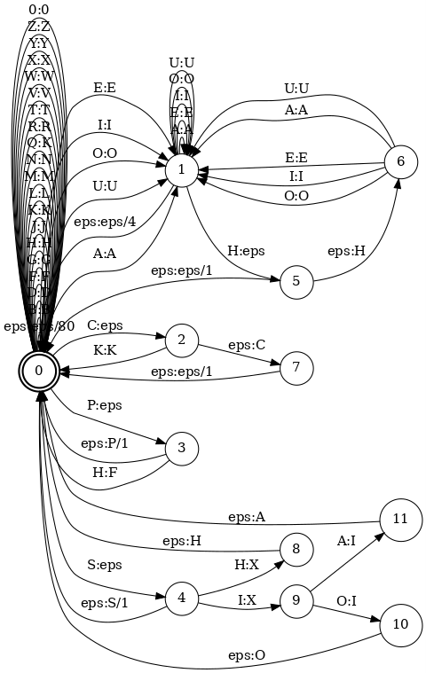

# Metaphone FST

A Finite State Transducer implementation of the [Metaphone](https://en.wikipedia.org/wiki/Metaphone) algorithm (simplified) for efficient phonetic matching. Developed as a mini-project for my Natural Language Processing course.

## Description

This work is a variation of the original [Metaphone](https://en.wikipedia.org/wiki/Metaphone). This code uses the 16 symbols 0BFHJKLMNPRSTWXY. The '0' (zero) represents "th" (as an ASCII approximation of Θ), 'X' represents "sh" or "ch", and the others represent their usual English pronunciations. The vowels AEIOU are also used, but only at the beginning of the word. The final product, `MetaphoneLN`, is an orderly composition (`fstcompose`) of smaller transducers (`step<1-9>`), each performing separate transformations:

`step1`: 
drop duplicated adjacent letters, except for 'C'.

`step2`:
if the word begins with 'KN', 'GN', 'PN', 'AE', or 'WR', drop the first letter.
if the word ends with 'MB' drop the 'B'.

`step3`:
'C' transforms to 'K' if in-between 'S' and 'H' ('-SCH-').
'C' transforms to 'X' if followed by 'H' (and it is not part of '-SCH-') or 'IA'.
'C' transforms to 'S' if followed by 'I' (and it is not part of '-CIA-'), 'E' or 'Y'.
Otherwise, 'C' transforms to 'K'.

`step4`:
'D' transforms to 'J' if followed by 'GE', 'GY' or 'GI'.
Otherwise, 'D' transforms to 'T'.

`step5`:
Drop 'G' if followed by 'H' and 'H' is not at the end.
if the word ends with 'GN' drop the 'G'.
if the word ends with 'GNED' drop the 'G'.

`step6`:
Drop 'H' if after a vowel and not before a vowel.
'CK' transforms to 'K'.
'PH' transforms to 'F'.
'Q' transforms to 'K'.
'S' transforms to 'X' if followed by 'H', 'IO' or 'IA'.



`step7`:
'T' transforms to 'X' if followed by 'IA' or 'IO'.
'TH' transforms to '0' (zero).
Drop 'T' if followed by 'CH'.
'V' transforms to 'F'.
'WH' transforms to 'W' if at the beginning.

`step8`:
'X' transforms to 'S' if at the beginning.
Otherwise, 'X' transforms to 'KS'.
Drop 'W' if not followed by a vowel.
Drop 'Y' if not followed by a vowel.
'Z' transforms to 'S'.

`step9`:
Drop all vowels unless it is the beginning.

Listed in [output_examples.pdf](output_examples.pdf) are examples of expected outputs after the application of the Metaphone algorithm. 

## Getting Started

### Dependencies

* Python 3
* [OpenFst](https://www.openfst.org/twiki/bin/view/FST/FstDownload)

Once downloaded, can be installed by executing the following command in the extracted folder's directory
```
./configure
make
make install
```

* [Graphviz](https://www.graphviz.org/)

Used by [run.sh](run.sh) to visualize produced FSTs, which have already been rendered and can be found in [images](images/). Can be installed (on Ubuntu, Debian,...) with
```
sudo apt install graphviz
```

### Executing the program

The script [run.sh](run.sh) converts each `step` from a 'friendly' compact format (in [friendly](friendly/)) to a regular representation (in [sources](sources/)) using [compact2fst.py](compact2fst.py). Then, in [tests](tests/), transforms given test strings (`.str`) into simple transducers also in regular representation (`.txt`) using [word2fst.py](word2fst.py). Then, compiles both the `steps`' and the tests' regular representations to their `.fst` format (stored into [compiled](compiled/)). Afterward, composes `MetaphoneLN` from the `steps`, and produces its inverse (`fstinvert`), `invertMetaphoneLN`. Then, generates PDFs of all compiled FSTs, except for `MetaphoneLN` and `invertMetaphoneLN`, which are too large to render in a feasible amount of time. Finally, it tests each `step` with the `tests`, and tests the reliability of `invertMetaphoneLN` by process of transforming a single input with `MetaphoneLN` and reversing said transformation with `invertMetaphoneLN`. The latter test was part of the project for educational purposes, as, in general, the `invertMetaphoneLN` does not reliably revert the `MetaphoneLN`'s transformations on a given input.

```
./run.sh
```

(The repository is already populated with [run.sh](run.sh)'s output.) 

To run `MetaphoneLN` on any given word (IN CAPS), first, convert the word into its simple transducer representation (`.txt` file)

```
./word2fst.py <input_word> > <word_transducer_TXT_file>
```

or, if the word is in a `.str` file

```
./word2fst.py `cat <word_STR_file>` > <word_transducer_TXT_file>
```

Then, compile the output into a transducer in `.fst` format

```
fstcompile --isymbols=syms.txt --osymbols=syms.txt <word_transducer_TXT_file> | fstarcsort > <word_transducer_FST_file>
```

Finally, compose the word's transducer with `MetaphoneLN` (assumed compiled) and print the resulting word's transducer in readable format by executing the following

```
fstcompose <word_transducer_FST_file> compiled/metaphoneLN.fst > <output_FST_file>
fstshortestpath <output_FST_file> | fstproject --project_type=output | fstrmepsilon | fsttopsort | fstprint --acceptor --isymbols=./syms.txt
```

## Help

Errors while loading shared libraries can probably be fixed by executing the following command

```
sudo ldconfig
```

## Authors

Joao Silva
Scripts [compact2fst.py](compact2fst.py) and [word2fst.py](word2fst.py) were provided by the teachers.